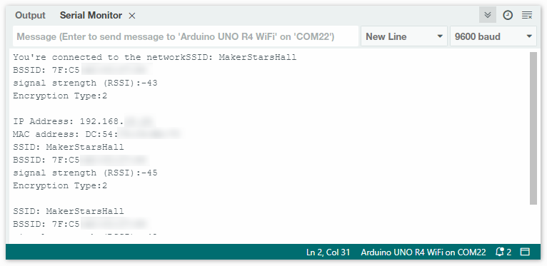

连接到 Wi-Fi
==================

本教程将引导您完成将 Arduino 板连接到 Wi-Fi 网络的基本步骤。您将学习如何初始化 Wi-Fi 模块、验证其固件，以及使用 SSID 和密码安全地加入网络。连接后，您将发现如何直接从串行控制台监控重要的网络详细信息，例如设备的 IP 和 MAC 地址以及网络的信号强度。本教程既是 Wi-Fi 连接的实用指南，也是使用 Arduino 进行网络监控的介绍，帮助您建立并维护可靠的 Wi-Fi 连接。

1. 上传代码
========================

打开路径 ``elite-explorer-kit-main\r4_new_feature\01-wifi_connect`` 下的 ``01-wifi_connect.ino`` 文件，或将此代码复制到 **Arduino IDE** 中。

.. note::
     通过随 Arduino UNO R4 Core 一起提供的内置 ``WiFiS3`` 库启用 Wi-Fi 支持。安装该核心会自动安装 ``WiFiS3`` 库。

您仍然需要创建或修改 ``arduino_secrets.h``，将 ``SECRET_SSID`` 和 ``SECRET_PASS`` 替换为您要连接的 WiFi 的名称和密码。该文件应包含：

.. code:: arduino

    //arduino_secrets.h header file
    #define SECRET_SSID "yournetwork"
    #define SECRET_PASS "yourpassword"

.. literalinclude:: /_code/01_1_connect_to_wifi_secrets.h
   :language: cpp
   :caption: arduino_secrets.h

.. literalinclude:: /_code/01_1_connect_to_wifi.ino
   :language: cpp
   :linenos:
   :caption: 01-wifi_connect.ino

打开串口监视器，您将看到类似如下内容。Arduino 将输出您设备的 IP 和 MAC 地址，以及网络的信号强度。

2. 代码说明
========================

1. 包含库和密钥数据

   .. code-block:: arduino

      #include <WiFiS3.h>
      #include "arduino_secrets.h"

   - ``WiFiS3`` 是一个提供 Wi-Fi 连接功能的库。安装 R4 核心会自动安装 WiFiS3 库。
   - ``arduino_secrets.h`` 是一个单独的文件，您可以在其中保存 SSID 和密码，这样它们就不会暴露在主代码中。将网络和密码分开存储可减少意外共享 Wi-Fi 凭据的风险。

   .. raw:: html

       

2. 声明全局变量

   .. code-block:: arduino

      char ssid[] = SECRET_SSID;
      char pass[] = SECRET_PASS;
      int status = WL_IDLE_STATUS;

   - ``ssid`` 和 ``pass`` 包含您的网络名称和密码。
   - ``status`` 将存储您的 Wi-Fi 连接的当前状态。

   .. raw:: html

       

3. ``setup()`` 函数

   串行接口以 9600 的波特率初始化。``while (!Serial);`` 行确保程序等待直到串行连接建立。

   .. code-block:: arduino

      void setup() {
          //Initialize serial and wait for port to open:
          Serial.begin(9600);
          while (!Serial) {
            ; // wait for serial port to connect. Needed for native USB port only
          }
          ...
      }

   然后，代码检查 Wi-Fi 模块是否可用。如果不可用，程序将停止，有效地阻止任何进一步的执行。

   .. code-block:: arduino

     ...
     // check for the WiFi module:
     if (WiFi.status() == WL_NO_MODULE) {
         Serial.println("Communication with WiFi module failed!");
         // don't continue
         while (true);
     }
     ...

   在代码的这一部分，我们检查 uno R4 wifi 的固件版本是否是最新的。如果不是最新版本，将显示升级提示。您可以参考 :ref:`update_firmware` 进行固件升级。

   .. https://forum.arduino.cc/t/radio-module-firmware-version-0-2-0-is-now-available/1147361

   .. code-block:: arduino

      ...
      String fv = WiFi.firmwareVersion();
      if (fv < WIFI_FIRMWARE_LATEST_VERSION) {
          Serial.println("Please upgrade the firmware");
      }
      ...

4. ``loop()`` 函数

   .. code-block:: arduino

      void loop() {
        // check the network connection once every 10 seconds:
        delay(10000);
        printCurrentNet();
      }

   - 每 10 秒，调用 ``printCurrentNet()`` 函数打印当前的网络详情。

**参考**

- |link_r4_wifi|
