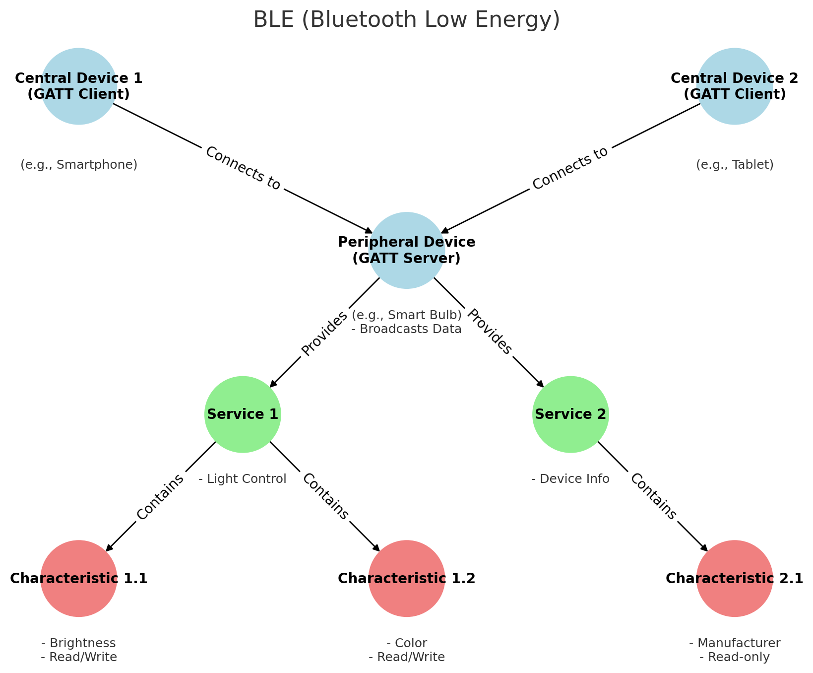

.. note::

    こんにちは、SunFounderのRaspberry Pi & Arduino & ESP32愛好家コミュニティへようこそ！Facebook上でRaspberry Pi、Arduino、ESP32についてもっと深く掘り下げ、他の愛好家と交流しましょう。

    **参加する理由は？**

    - **エキスパートサポート**：コミュニティやチームの助けを借りて、販売後の問題や技術的な課題を解決します。
    - **学び＆共有**：ヒントやチュートリアルを交換してスキルを向上させましょう。
    - **独占的なプレビュー**：新製品の発表や先行プレビューに早期アクセスしましょう。
    - **特別割引**：最新製品の独占割引をお楽しみください。
    - **祭りのプロモーションとギフト**：ギフトや祝日のプロモーションに参加しましょう。

    👉 私たちと一緒に探索し、創造する準備はできていますか？[|link_sf_facebook|]をクリックして今すぐ参加しましょう！

.. _new_bluetooth:

Bluetooth
========================================

ESP32モジュールを搭載したUNO R4 WiFiボードは、Bluetooth® LEおよびBluetooth® 5の機能を提供し、最大2 Mbpsの速度に対応しています。ESP32モジュールには統合されたトレースアンテナが付いており、ボードの接続機能を利用するために外部アンテナを必要としません。

.. note::
    ESP32モジュールのトレースアンテナはBluetooth®モジュールと共有されているため、Bluetooth®とWi-Fi®を同時に使用することはできません。

BLEの基本概念
++++++++++++++++++++++++

**Bluetooth Low Energy (BLE)** は、短距離通信用に特化された低消費電力の無線通信技術です。従来のBluetoothとは異なり、BLEは省電力と迅速な接続に焦点を当てており、IoTデバイスや健康モニタリング機器など幅広いアプリケーションに理想的です。

BLE通信は、 **GATT（Generic Attribute Profile）** と **GAP（Generic Access Profile）** の2つの主要なプロトコルに依存しています。GATTはデータ交換用に、GAPはデバイスの発見と接続用に使用されます。

周辺機器（通常はGATTサーバー）
--------------------------------------------------

BLEネットワークにおいて、 **周辺機器** は主にデータをブロードキャストし、中央デバイス（通常はGATTクライアントとして機能）によって発見およびアクセスされます。これらのデバイスは通常、センサーや心拍数モニター、温度センサー、スマート電球などの小型ハードウェアです。

BLE通信モデルにおいて、周辺機器はしばしば1つ以上の **サービス** を提供し、各サービスは一連の **特性** を含んでいます。これらのサービスと特性は、特定の機能やユースケースを可能にし、中央デバイスが関連データを読み取ったり操作したりできるようにします。

- **サービス**

  BLEにおいて、サービスは関連する特性を整理し、カプセル化するために使用される高レベルの抽象化です。BLEのサービスは、その起源と目的に基づいて標準サービスとカスタムサービスに分類されます。

  - 標準サービス：Bluetooth SIG（Bluetooth Special Interest Group）によって定義され、特定の機能のために意図されています。例えば、心拍数モニターのための心拍数サービス、製造元、モデル、バージョンの詳細を提供するデバイス情報サービス、バッテリーレベルとステータスを示すバッテリーサービスなどがあります。
  - カスタムサービス：開発者やデバイスメーカーによって、特定のアプリケーションやデバイスの要件に合わせて定義されます。例えば、スマートホームデバイスメーカーは、ライトの色や明るさを制御するためのカスタムサービスを定義することがあります。

- **特性**

  BLEにおける特性は、周辺機器によって公開されるデータの基本単位です。これらはサービス内に含まれ、さまざまなタイプのデータとそれらに対する操作を定義します。各特性はUUIDによって識別され、値、記述子、権限などの関連属性を持ちます。

  - 権限：BLEでは、各特性は特性が読み取り可能、書き込み可能、通知可能であるかどうかを示す一連の権限と関連付けられています。これにより、データの保護と操作方法の定義が可能になります。

- **UUID**

  サービス、特性、記述子は、属性として集約され、それぞれがユニークなUUIDを持ちます。Bluetooth SIGは、標準属性のために一連のUUIDを予約しています。これらのUUIDは、BLEプロトコルでは効率のために通常16ビットまたは32ビットの識別子として表され、完全なUUIDに必要な128ビットよりも短くなります。例えば、デバイス情報サービスは短いコード0x180Aで表されます。

中央デバイス（通常はGATTクライアント）
--------------------------------------------------

BLEネットワークにおける **中央デバイス** は、近くの周辺デバイスをスキャンし、データを取得または制御するために接続を確立します。これらのデバイスは通常、スマートフォン、タブレット、または特化されたゲートウェイハードウェアなど、より複雑で機能豊富です。中央デバイスは、周辺デバイスの発見、接続、および周辺デバイスが提供するサービスや特性へのアクセスやサブスクリプションを担当し、さまざまなアプリケーションにサービスを提供したり、特定の問題を解決する役割を果たします。

中央デバイスは、以下の方法で特性と対話します：

- **読み取り**：周辺機器に特性の現在の値を送信するよう要求します。これは、頻繁に変更されない特性によく使用されます。例えば、設定やバージョン番号など。
- **書き込み**：特性の値を変更します。これは、周辺機器にモーターのオン/オフのようなコマンド操作を指示するためによく使用されます。
- **サブスクライブ**：周辺機器に特性の値を継続的に送信するよう要求します。これにより、中央デバイスがこのデータを繰り返し要求する必要がなくなります。

例：Bluetooth制御LED
++++++++++++++++++++++++++++++++++++++++++++++++++++++++

この例では、ArduinoはBluetooth Low Energy（BLE）ネットワーク内で周辺機器として機能します。オンボードLEDを制御するために設計されたカスタムBLEサービスを提供します。このサービスには、スマートフォンなどの中央デバイスによって読み書きが可能な特性が含まれています。中央デバイスがArduinoに接続すると、この特性に書き込むことでLEDの状態を変更できます。Arduinoのシリアルモニターは、LEDの現在の状態や接続された中央デバイスのMACアドレスなどのデバッグ情報を表示します。

**コードのアップロード**

``02-bluetooth.ino`` ファイルを ``elite-explorer-kit-main\r4_new_feature\02-bluetooth`` から開くか、以下のコードをArduino IDEに貼り付けます。

.. raw:: html

   <iframe src=https://create.arduino.cc/editor/sunfounder01/44d76bb7-9f0a-4004-b3fe-9a88999c5f06/preview?embed style="height:510px;width:100%;margin:10px 0" frameborder=0></iframe>

**Bluetoothを介したArduino R4との接続**

このスケッチで作成されたサービスと特性を操作するには、LightBlue（iOSおよびAndroid用）やnRF Connect（Android用）などの一般的なBluetooth® Low Energy中央アプリを利用する必要があります。

例としてLightBlueを使用して、Bluetooth経由でArduinoのLEDを制御する方法を示します。

1. **LightBlue** アプリを |link_lightblue_apple| （iOS用）または |link_lightblue_google| （Android用）からダウンロードします。

   .. image:: img/02_lightblue.png
    :width: 90%

   .. raw:: html

        

2. Bluetoothを介してスマートフォンとArduinoを接続
   
   Bluetooth設定に移動し、「UNO R4 LED」というデバイスを探して接続します。

   .. image:: img/02_connect.png
    :width: 90%

   .. raw:: html

       

3. LightBlueを使用してBluetooth経由でArduinoと対話

   LightBlueを起動し、画面下部にある **Bonded** タブをタップします。ここでは、スマートフォンが以前にペアリングしたBLEデバイスのリストが表示されます。 **UNO R4 LED** を探して **CONNECT** をタップします。

   .. image:: img/02_lightblue_1.png
    :width: 90%

   接続すると、「UNO R4 LED」Bluetoothデバイスの詳細情報にアクセスできます。「ledService（ **19B10000-E8F2-537E-4F6C-D104768A1214** ）」および「switchCharacteristic（ **19B10001-E8F2-537E-4F6C-D104768A1214** ）」を探します。

   19B10001-E8F2-537E-4F6C-D104768A1214特性をタップします。この特性は読み取りと書き込みが可能であり、読み取りおよび書き込みを行うことができます。
  
   .. image:: img/02_lightblue_2.png
    :width: 90%

   そのまま **WRITTEN VALUES** セクションまでスクロールします。テキストボックスに「 **1** 」と入力すると、Characteristicの値が1に設定され、Arduino R4のオンボードLEDが **点灯します** 。

   .. image:: img/02_lightblue_3.png
    :width: 90%
   
   同様に、この値を「 **0** 」に設定すると、 **オンボードLED** をオフにすることができる。

   .. image:: img/02_lightblue_4.png
    :width: 90%

**コードの説明**

#. BLEとLEDの初期化

   .. note::
      サービスや特性を定義する際には、UUIDを使用して識別する必要があります。UUIDの衝突を避け、簡単に使用できるようにするため、 |link_uuid_gen_tool| でUUID生成ツールを利用できます。

   .. code-block:: arduino
   
      #include <ArduinoBLE.h>
      BLEService ledService("19B10000-E8F2-537E-4F6C-D104768A1214"); // Bluetooth® Low Energy LED Service
      BLEByteCharacteristic switchCharacteristic("19B10001-E8F2-537E-4F6C-D104768A1214", BLERead | BLEWrite);
      const int ledPin = LED_BUILTIN; // pin to use for the LED

   - Include the ArduinoBLE library.
   - Define the BLE service and characteristic. 
   - Assign the built-in LED pin to ``ledPin``.

   .. raw:: html

       

#. ``setup()`` 関数

   .. code-block:: arduino
   
      void setup() {
        Serial.begin(9600);
        while (!Serial);
        pinMode(ledPin, OUTPUT);
        if (!BLE.begin()) {
          Serial.println("starting Bluetooth® Low Energy module failed!");
          while (1);
        }
        BLE.setLocalName("UNO R4 LED");
        BLE.setAdvertisedService(ledService);
        ledService.addCharacteristic(switchCharacteristic);
        BLE.addService(ledService);
        switchCharacteristic.writeValue(0);
        BLE.advertise();
        Serial.println("BLE LED Peripheral");
      }

   - シリアル通信を初期化。
   - LEDピンを出力として設定。
   - BLEを初期化し、サービスと特性を追加。
   - BLE広告を開始。

   .. raw:: html

       

#. ``loop()`` 関数

   .. code-block:: arduino
   
      void loop() {
        BLEDevice central = BLE.central();
        if (central) {
          Serial.print("Connected to central: ");
          Serial.println(central.address());
          while (central.connected()) {
            if (switchCharacteristic.written()) {
              if (switchCharacteristic.value()) {
                Serial.println("LED on");
                digitalWrite(ledPin, HIGH);
              } else {
                Serial.println("LED off");
                digitalWrite(ledPin, LOW);
              }
            }
          }
          Serial.print("Disconnected from central: ");
          Serial.println(central.address());
        }
      }

   - BLE中央デバイスの接続を待ちます。
   - 中央デバイスが接続された場合、特性の値を読み取ってLEDを制御します。0以外の値が受信された場合はLEDを点灯し、0が受信された場合はLEDを消灯します。

**参照**

- |link_r4_bluetooth|