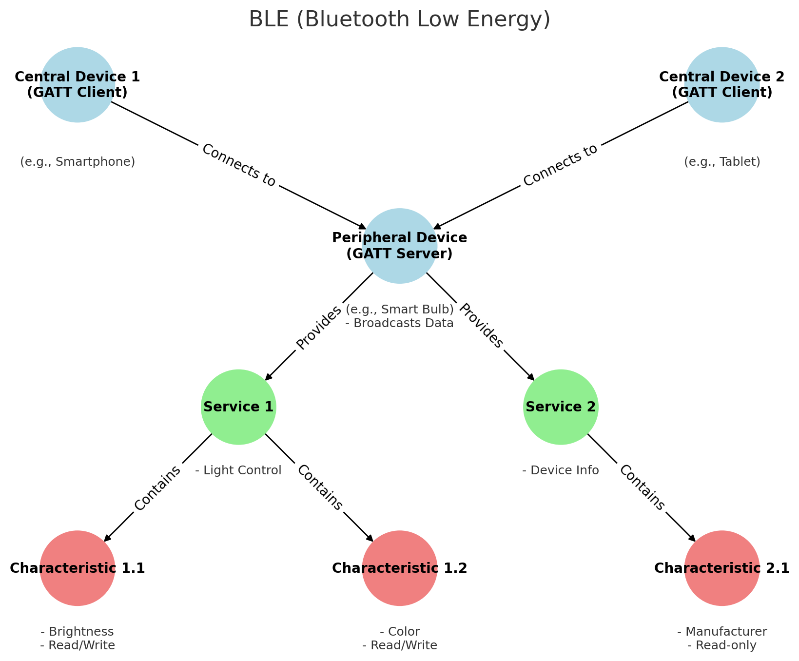

.. note::

    Bonjour, bienvenue dans la communauté des passionnés de SunFounder Raspberry Pi, Arduino et ESP32 sur Facebook ! Plongez au cœur de Raspberry Pi, Arduino et ESP32 avec d'autres passionnés.

    **Pourquoi nous rejoindre ?**

    - **Support d'experts** : Résolvez les problèmes après-vente et les défis techniques avec l'aide de notre communauté et de notre équipe.
    - **Apprendre et partager** : Échangez des astuces et des tutoriels pour améliorer vos compétences.
    - **Aperçus exclusifs** : Accédez en avant-première aux annonces de nouveaux produits et aux avant-premières.
    - **Réductions exclusives** : Profitez de réductions exclusives sur nos produits les plus récents.
    - **Promotions festives et cadeaux** : Participez à des concours et des promotions festives.

    👉 Prêt à explorer et créer avec nous ? Cliquez sur [|link_sf_facebook|] et rejoignez-nous dès aujourd'hui !

.. _new_bluetooth:

Bluetooth
========================================

Équipée du module ESP32, la carte UNO R4 WiFi offre à la fois les fonctionnalités Bluetooth® LE et Bluetooth® 5, supportant des vitesses allant jusqu'à 2 Mbps. Le module ESP32 est doté d'une antenne trace intégrée, éliminant le besoin d'une antenne externe pour profiter des fonctionnalités de connectivité de la carte.

.. note::
    L'antenne trace du module ESP32 est partagée avec le module Bluetooth®, ce qui signifie que vous ne pouvez pas utiliser le Bluetooth® et le Wi-Fi® en même temps.

Concepts de base du BLE
++++++++++++++++++++++++

**Bluetooth Low Energy (BLE)** est une technologie de communication sans fil à faible consommation d'énergie, conçue spécifiquement pour les interactions à courte portée. Distinguée du Bluetooth classique, le BLE se concentre sur l'efficacité énergétique et la connexion rapide, ce qui en fait un choix idéal pour une gamme d'applications, y compris les dispositifs de l'Internet des objets (IoT) et les équipements de surveillance de la santé.

Les communications BLE reposent sur deux protocoles clés : **GATT (Generic Attribute Profile)** et **GAP (Generic Access Profile)**. GATT est utilisé pour l'échange de données, tandis que GAP est responsable de la découverte et de la connexion des dispositifs.

Appareils périphériques (Typiquement serveurs GATT)
--------------------------------------------------=====

Dans le réseau BLE, les **appareils périphériques** diffusent principalement des données pour être découverts et accessibles par les appareils centraux (jouant généralement le rôle de clients GATT). Ces appareils sont généralement des capteurs ou des petits matériels comme des moniteurs de fréquence cardiaque, des capteurs de température ou des ampoules intelligentes.

Dans le modèle de communication BLE, les appareils périphériques offrent souvent un ou plusieurs **services**, chacun contenant un ensemble de **caractéristiques**. Ces services et caractéristiques permettent des fonctionnalités ou des cas d'utilisation spécifiques, permettant aux appareils centraux de lire ou de manipuler les données pertinentes.

- **Services**

  Dans BLE, les services agissent comme des abstractions de haut niveau utilisées pour organiser et encapsuler les caractéristiques associées. Les services dans BLE peuvent être classés en services standard et services personnalisés en fonction de leur origine et de leur objectif.

  - Services standard : Définis par le Bluetooth SIG (Bluetooth Special Interest Group), ils sont destinés à des fonctions spécifiques. Par exemple, le service de fréquence cardiaque pour les moniteurs de fréquence cardiaque, le service d'information sur l'appareil fournissant des détails sur le fabricant, le modèle et la version, et le service de batterie indiquant le niveau et l'état de la batterie.
  - Services personnalisés : Ceux-ci sont définis par les développeurs ou les fabricants d'appareils pour répondre aux exigences d'applications ou d'appareils spécifiques. Par exemple, un fabricant de dispositifs domotiques pourrait définir un service personnalisé pour contrôler la couleur et la luminosité des lumières.

- **Caractéristiques**

  Les caractéristiques dans BLE sont les unités fondamentales de données exposées par les appareils périphériques. Elles sont enfermées dans un service et définissent divers types de données et les opérations pouvant être effectuées sur elles. Chaque caractéristique est identifiée par un UUID et possède un ensemble d'attributs associés tels que la valeur, le descripteur et les permissions.

  - Permissions : Dans BLE, chaque caractéristique est associée à un ensemble de permissions dictant si la caractéristique est lisible, inscriptible ou notifiable. Cela aide à sécuriser les données et à définir comment interagir avec elles.

- **UUID**

  Les services, les caractéristiques et les descripteurs sont collectivement identifiés comme des attributs, chacun ayant un UUID unique. Le Bluetooth SIG a réservé un ensemble d'UUID pour les attributs standard. Ces UUID sont généralement représentés sous forme d'identifiants de 16 bits ou de 32 bits dans le protocole BLE pour plus d'efficacité, plutôt que les 128 bits requis pour un UUID complet. Par exemple, le service d'information sur l'appareil est représenté par le code court 0x180A.

Appareils centraux (Typiquement clients GATT)
--------------------------------------------------

Les **appareils centraux** dans le réseau BLE scannent les appareils périphériques à proximité et établissent des connexions pour acquérir ou contrôler des données. Ces appareils sont généralement plus complexes et riches en fonctionnalités, tels que les smartphones, les tablettes ou les matériels passerelles spécialisés. Ils sont responsables de la découverte des appareils périphériques, de la connexion à ceux-ci, et de l'accès ou de l'abonnement aux services et caractéristiques offerts par les périphériques pour servir diverses applications ou résoudre des problèmes spécifiques.

Les appareils centraux interagissent avec les caractéristiques de la manière suivante :

- **Lire** : Demander à l'appareil périphérique d'envoyer la valeur actuelle d'une caractéristique. Cela est couramment utilisé pour les caractéristiques qui ne changent pas souvent, comme les paramètres de configuration ou les numéros de version.
- **Écrire** : Modifier la valeur d'une caractéristique, généralement utilisée pour des opérations de type commande, comme demander à un appareil périphérique d'allumer ou d'éteindre un moteur.
- **S'abonner** : Demander à l'appareil périphérique d'envoyer continuellement des valeurs mises à jour d'une caractéristique, éliminant ainsi le besoin pour l'appareil central de demander cette donnée à plusieurs reprises.

Exemple : LED contrôlée par Bluetooth
++++++++++++++++++++++++++++++++++++++++++++++++++++++++

Dans cet exemple, l'Arduino agit comme un appareil périphérique dans un réseau Bluetooth Low Energy (BLE). Il offre un service BLE personnalisé conçu pour contrôler une LED embarquée. Ce service comprend une caractéristique qui peut être lue et écrite par un appareil central, tel qu'un smartphone. Une fois que l'appareil central se connecte à l'Arduino, il peut changer l'état de la LED en écrivant dans cette caractéristique. Le moniteur série de l'Arduino affiche des informations de débogage, y compris l'état actuel de la LED et l'adresse MAC de l'appareil central connecté.

**Télécharger le code**

Ouvrez le fichier ``02-bluetooth.ino`` situé dans ``elite-explorer-kit-main\r4_new_feature\02-bluetooth``, ou collez le code suivant dans votre IDE Arduino.

.. literalinclude:: /_code/02_bluetooth.ino
   :language: cpp
   :linenos:
   :caption: 02-bluetooth.ino

**Connecter l'Arduino R4 via Bluetooth**

Pour interagir avec les services et les caractéristiques créés dans ce sketch, nous devons utiliser une application centrale Bluetooth® Low Energy générique telle que LightBlue (disponible pour iOS et Android) ou nRF Connect (pour Android).

Prenons LightBlue comme exemple pour démontrer comment contrôler la LED de l'Arduino via Bluetooth.

1. Téléchargez l'application **LightBlue** depuis le |link_lightblue_apple| (pour iOS) ou |link_lightblue_google| (pour Android).

   .. image:: img/02_lightblue.png
    :width: 90%

   .. raw:: html

        

2. Connecter l'Arduino avec votre smartphone via Bluetooth
   
   Allez dans vos paramètres Bluetooth et localisez l'appareil nommé "UNO R4 LED". Procédez à la connexion.

   .. image:: img/02_connect.png
    :width: 90%

   .. raw:: html

       

3. Interagir avec l'Arduino via Bluetooth en utilisant LightBlue

   Lancez LightBlue et appuyez sur l'onglet **Bonded** situé en bas de l'interface. Ici, vous verrez une liste des appareils BLE avec lesquels votre smartphone a été précédemment appairé. Localisez **UNO R4 LED** et appuyez sur **CONNECT**.

   .. image:: img/02_lightblue_1.png
    :width: 90%

   Une fois connecté, vous accéderez aux informations détaillées sur l'appareil Bluetooth "UNO R4 LED". Faites défiler pour trouver "ledService (**19B10000-E8F2-537E-4F6C-D104768A1214**)" et "switchCharacteristic (**19B10001-E8F2-537E-4F6C-D104768A1214**)".

   Appuyez sur la caractéristique 19B10001-E8F2-537E-4F6C-D104768A1214. Vous remarquerez que cette caractéristique est à la fois lisible et inscriptible, vous permettant de lire et d'écrire des données.

   .. image:: img/02_lightblue_2.png
    :width: 90%

   Continuez à faire défiler jusqu'à la section **WRITTEN VALUES**. Saisissez '**1**' dans la zone de texte pour définir la valeur de la caractéristique à 1, ce qui **allumera la LED embarquée de l'Arduino R4**.

   .. image:: img/02_lightblue_3.png
    :width: 90%

   De même, vous pouvez définir cette valeur à '**0**' pour **éteindre la LED embarquée**.

   .. image:: img/02_lightblue_4.png
    :width: 90%

**Explication du code**

#. Initialiser BLE et LED

   .. note::
      Lors de la définition des services et des caractéristiques, nous devons utiliser des UUID pour les identifier. Pour éviter les conflits d'UUID et faciliter leur utilisation, vous pouvez utiliser l'outil de génération d'UUID à |link_uuid_gen_tool|.

   .. code-block:: arduino
   
      #include <ArduinoBLE.h>
      BLEService ledService("19B10000-E8F2-537E-4F6C-D104768A1214"); // Service LED Bluetooth® Low Energy
      BLEByteCharacteristic switchCharacteristic("19B10001-E8F2-537E-4F6C-D104768A1214", BLERead | BLEWrite);
      const int ledPin = LED_BUILTIN; // broche à utiliser pour la LED

   - Inclure la bibliothèque ArduinoBLE.
   - Définir le service et la caractéristique BLE.
   - Assigner la broche LED intégrée à ``ledPin``.

   .. raw:: html

       

#. Fonction ``setup()``

   .. code-block:: arduino
   
      void setup() {
        Serial.begin(9600);
        while (!Serial);
        pinMode(ledPin, OUTPUT);
        if (!BLE.begin()) {
          Serial.println("starting Bluetooth® Low Energy module failed!");
          while (1);
        }
        BLE.setLocalName("UNO R4 LED");
        BLE.setAdvertisedService(ledService);
        ledService.addCharacteristic(switchCharacteristic);
        BLE.addService(ledService);
        switchCharacteristic.writeValue(0);
        BLE.advertise();
        Serial.println("BLE LED Peripheral");
      }

   - Initialiser la communication série.
   - Configurer la broche LED en sortie.
   - Initialiser le BLE et ajouter le service et les caractéristiques.
   - Commencer la publicité BLE.

   .. raw:: html

       

#. Fonction ``loop()``

   .. code-block:: arduino
   
      void loop() {
        BLEDevice central = BLE.central();
        if (central) {
          Serial.print("Connected to central: ");
          Serial.println(central.address());
          while (central.connected()) {
            if (switchCharacteristic.written()) {
              if (switchCharacteristic.value()) {
                Serial.println("LED on");
                digitalWrite(ledPin, HIGH);
              } else {
                Serial.println("LED off");
                digitalWrite(ledPin, LOW);
              }
            }
          }
          Serial.print("Disconnected from central: ");
          Serial.println(central.address());
        }
      }
   

   - Écouter les appareils centraux BLE pour se connecter.
   - Si un appareil central est connecté, lire la valeur de la caractéristique pour contrôler la LED. Si une valeur différente de 0 est reçue, allumer la LED. Si 0 est reçu, éteindre la LED.

**Référence**

- |link_r4_bluetooth|