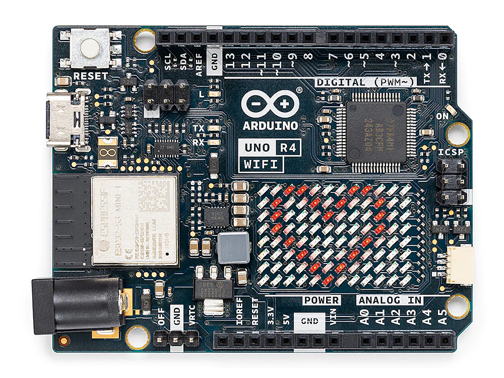

.. _new_led_matrix:

12x8 LED Matrix
========================================

The Arduino UNO R4 WiFi comes with an integrated 12x8 LED Matrix that can be programmed to display a variety of graphics, animations, act as an interface, or even facilitate gaming experiences.

In this guide, we provide a straightforward example to help you display your desired pattern on the LED Matrix.

How to store LED matrix data in Arduino
-----------------------------------------

To utilize the LED matrix, you'll need the ``Arduino_LED_Matrix`` library, which is installed along with the Renesas core.

The LED Matrix library for the UNO R4 WiFi operates by creating and loading frames into a buffer to display them. A frame, also known as an "image," represents what is currently shown on the matrix. In an animation consisting of multiple images, each image is considered a frame.

To control the 12x8 LED matrix on the UNO R4 WiFi, a minimum of 96 bits of memory space is required. The library offers two approaches for this.

**One approach uses a two-dimensional array**, with zeros and ones to represent whether the corresponding LED is off or on.  Each number corresponds to an LED on the LED matrix. The following array illustrates a heart-shaped pattern.

.. code-block:: arduino
   
   // Use a two-dimensional array to represent a 12x8 LED matrix.
   byte frame[8][12] = {
     { 0, 0, 1, 1, 0, 0, 0, 1, 1, 0, 0, 0 },
     { 0, 1, 0, 0, 1, 0, 1, 0, 0, 1, 0, 0 },
     { 0, 1, 0, 0, 0, 1, 0, 0, 0, 1, 0, 0 },
     { 0, 0, 1, 0, 0, 0, 0, 0, 1, 0, 0, 0 },
     { 0, 0, 0, 1, 0, 0, 0, 1, 0, 0, 0, 0 },
     { 0, 0, 0, 0, 1, 0, 1, 0, 0, 0, 0, 0 },
     { 0, 0, 0, 0, 0, 1, 0, 0, 0, 0, 0, 0 },
     { 0, 0, 0, 0, 0, 0, 0, 0, 0, 0, 0, 0 }
   };

**Another approach employs an array of 32-bit integers** to maintain the LED matrix status. This method is more compact but slightly more complex. Each ``unsigned long`` stores 32 bits. Hence, for a 12x8 LED matrix, which contains 96 LEDs, you'll need at least three ``unsigned long`` variables.

1. Each ``unsigned long`` contains 32 bits, and you can think of these bits as the state of a certain part in an LED matrix.
2. These ``unsigned long`` variables form an array that encapsulates the complete LED matrix state.

Here's a code snippet using three `unsigned long` variables to represent a 12x8 LED matrix.

.. code-block:: arduino

   // Use an array of 32-bit integers to store the LED matrix.
   unsigned long frame[] = {
     0x3184a444, // State of the first 32 LEDs
     0x42081100, // State of the next 32 LEDs
     0xa0040000  // State of the last 32 LEDs
   };

To better visualize the LED statuses, these values can be converted to binary form, where each bit sequentially represents each LED state from left to right and top to bottom. A 0 indicates off, and a 1 indicates on.

.. code-block:: arduino

   0x3184a444 -> 110001100001001010010001000100
   0x42081100 -> 1000010000010000001000100000000
   0xa0040000 -> 10100000000001000000000000000000

Display pattern on LED matrix
-----------------------------------------

Once your pattern is ready, the next step is to transmit this data to the 12x8 LED Matrix. This usually involves invoking library functions and passing the array or variables containing the LED states to these functions.

1. Using a two-dimensional Array

   To display the pattern stored in a 2D array, you can use the following code:
   
   .. code-block:: arduino
   
      #include <Arduino_LED_Matrix.h>
   
      ArduinoLEDMatrix matrix;
   
      // Pre-defined 2D array
      byte frame[8][12] = {
           { 0, 0, 1, 1, 0, 0, 0, 1, 1, 0, 0, 0 },
           { 0, 1, 0, 0, 1, 0, 1, 0, 0, 1, 0, 0 },
           { 0, 1, 0, 0, 0, 1, 0, 0, 0, 1, 0, 0 },
           { 0, 0, 1, 0, 0, 0, 0, 0, 1, 0, 0, 0 },
           { 0, 0, 0, 1, 0, 0, 0, 1, 0, 0, 0, 0 },
           { 0, 0, 0, 0, 1, 0, 1, 0, 0, 0, 0, 0 },
           { 0, 0, 0, 0, 0, 1, 0, 0, 0, 0, 0, 0 },
           { 0, 0, 0, 0, 0, 0, 0, 0, 0, 0, 0, 0 }
      };
   
      void setup() {
        // Initialize LED matrix
        matrix.begin();
      }
   
      void loop() {
        // Display pattern on the LED matrix
        matrix.renderBitmap(frame, 8, 12);
        delay(1000);
      }
   
   In this code, we use the ``matrix.renderBitmap(frame, 8, 12);`` function to display the LED matrix. Here, 8 and 12 respectively represent the rows and columns of the LED matrix.

2. Using an Array of 32-bit integers
   
   To display the pattern stored in an array of ``unsigned long``, use the following code:
   
   .. code-block:: arduino
   
      #include "Arduino_LED_Matrix.h"
      
      ArduinoLEDMatrix matrix;
      
      void setup() {
        matrix.begin();
      }
      
      const uint32_t heart[] = {
          0x3184a444,
          0x44042081,
          0x100a0040
      };
        
      void loop(){
        matrix.loadFrame(heart);
        delay(500);
      }
   
   In this case, we need to use the ``matrix.loadFrame(heart)`` function to display the pattern on the LED matrix.

Arduino LED Matrix Editor
-----------------------------------------

I recommend using an ``unsigned long`` array to store the state of the LED matrix, as it saves memory on the Arduino. Though this method might not be very intuitive, you can use the |link_led_matrix_editor| as an aid, which helps you generate an ``unsigned long`` array. 

With the |link_led_matrix_editor| and the ``Arduino_LED_Matrix`` library, you can conveniently create icons or animations and display them on the UNO R4 WiFi board. All you have to do is draw, download the ``.h`` file, and call the ``matrix.play()`` function in your sketch to easily build your next project.

#. Open the LED Matrix Editor

   .. image:: img/04_led_matrix_editor_1.png
     :width: 80%

#. Draw your pattern on the center canvas

   .. image:: img/04_led_matrix_editor_2.png
     :width: 80%

#. Set the frame interval in milliseconds

   .. image:: img/04_led_matrix_editor_3.png
     :width: 80%

#. You can create a new blank frame or copy and create a new frame from the current frame.

   .. image:: img/04_led_matrix_editor_4.png
     :width: 80%

#. Export the ``.h`` header file

   .. image:: img/04_led_matrix_editor_5.png
     :width: 80%

   .. image:: img/04_led_matrix_editor_6.png

   After clicking OK, you'll receive a file named ``animation.h``.

Display Animations
-----------------------------------------

In the previous steps, we obtained a ``.h`` file that stores a series of frames along with their durations. Next, let's display them on the LED matrix.

#. First, create a sketch. You can either open the ``04-led_matrix.ino`` file located under the path ``Elite-Explorer-Kit-main\r4_new_feature\04-led_matrix``, or copy this code into the **Arduino IDE**.

   .. raw:: html

      <iframe src=https://create.arduino.cc/editor/sunfounder01/f3712371-7c3d-4a4b-bd98-f74fe43269ed/preview?embed style="height:510px;width:100%;margin:10px 0" frameborder=0></iframe>

#. If you are using code from the ``Elite-Explorer-Kit-main\r4_new_feature\04-led_matrix`` path, you'll find a tab named ``animation.h`` in the Arduino IDE. Open it and replace the existing code with the .h file you obtained from the website.

   .. image:: img/04_animation_h_file.png
     :width: 80%

#. If you have created your own sketch, you need to copy the ``.h`` file obtained from the webpage to the same directory of the sketch.

#. After setting up your preferred code in the Arduino IDE and uploading it to your Arduino UNO R4 WiFi, your LED matrix should now display the pattern you defined.

   .. raw:: html
   
      <video loop autoplay muted style = "max-width:100%">
         <source src="../_static/videos/new_feature_projects/led_matrix.mp4"  type="video/mp4">
         Your browser does not support the video tag.
      </video>

   Congratulations! You've successfully programmed your Arduino UNO R4 WiFi's 12x8 LED Matrix!

**Reference**

- |link_r4_led|

**More Projects**

* :ref:`fun_snake` (Fun Project)

