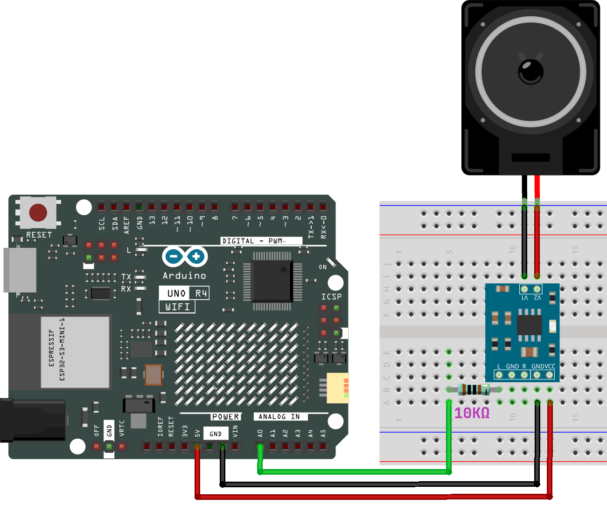

.. note::

    こんにちは、SunFounderのRaspberry Pi & Arduino & ESP32愛好家コミュニティへようこそ！Facebook上でRaspberry Pi、Arduino、ESP32についてもっと深く掘り下げ、他の愛好家と交流しましょう。

    **参加する理由は？**

    - **エキスパートサポート**：コミュニティやチームの助けを借りて、販売後の問題や技術的な課題を解決します。
    - **学び＆共有**：ヒントやチュートリアルを交換してスキルを向上させましょう。
    - **独占的なプレビュー**：新製品の発表や先行プレビューに早期アクセスしましょう。
    - **特別割引**：最新製品の独占割引をお楽しみください。
    - **祭りのプロモーションとギフト**：ギフトや祝日のプロモーションに参加しましょう。

    👉 私たちと一緒に探索し、創造する準備はできていますか？[|link_sf_facebook|]をクリックして今すぐ参加しましょう！

.. _new_dac:

デジタル・アナログ・コンバータ（DAC）
==========================================

Arduino Uno R4 WiFiには、内蔵のDAC（デジタル・アナログ・コンバータ）機能が搭載されています。DACはデジタル信号をアナログに変換するために不可欠であり、オーディオ処理、アナログ信号生成など、精密なアナログ出力を必要とするアプリケーションで特に重要な機能です。

Uno R4 WiFiのDACは最大12ビットの分解能を誇り、PWMピンの性能を上回る真のアナログ出力能力を提供します。

.. image:: img/05_dac.png
  :width: 70%

DACを使用して音楽を再生する
+++++++++++++++++++++++++++++++

**回路図**

**コードのアップロード**

``elite-explorer-kit-main\r4_new_feature\05-dac`` にある ``05-dac.ino`` ファイルを開くか、以下のコードをArduino IDEに貼り付けてください。

.. note:: 
    正常な動作を確保するために、コードと同じディレクトリに ``pitches.h`` ファイルを配置してください。

.. raw:: html

   <iframe src=https://create.arduino.cc/editor/sunfounder01/93e0379e-1d2d-4d9c-a603-42b3335e8e05/preview?embed style="height:510px;width:100%;margin:10px 0" frameborder=0></iframe>

このプロジェクトは、ArduinoとDAC（デジタル・アナログ・コンバータ）を活用して、アイコニックなスーパーマリオブラザーズのテーマ曲を再生します。これには、正弦波生成用の ``analogWave`` ライブラリと、音符の周波数を定義するための ``pitches.h`` ライブラリが使用されています。

- ``melody[]``: この配列には演奏する音符とその持続時間が含まれています。音符は事前定義のピッチで表され（例： ``NOTE_E5`` ）、持続時間は拍（例：4はクォーターノートを示します）で表されます。melody[] 配列内の音符と持続時間を変更して、独自のメロディを試すことができます。興味があれば、GitHub上に（|link_arduino_songs|）というリポジトリがあり、さまざまな曲を再生するためのArduinoコードが提供されています。彼らのアプローチはこのプロジェクトと異なるかもしれませんが、彼らの音符と持続時間を参照できます（対応するトラック内の ``melody[]`` をこのプロジェクトのコードで置き換えるだけです）。

- ``tempo``: このプロジェクトのテンポは200 BPM（分速ビート）に設定されており、各音符の持続時間を計算するために使用されます。この値を変更すると曲の演奏速度が変わります。

- **Sine Wave Generator**: ``analogWave`` ライブラリの ``sine`` 関数は、10 Hzの正弦波ジェネレータを初期化し、DACを介して音符を出力するために使用されます。

- **Note Duration**: 設定したテンポと各音符の拍数に基づいて、各音符の持続時間が計算されます。

- **Play and Pause**: 各音符は計算された持続時間の85%再生され、音符間を区別するために15%の一時停止が挿入されます。

- **Loop**: メロディが完了すると、コードは自動的にリセットされ、再び再生が開始されます。

これは、Arduinoと外部ハードウェア（DAC）を使用して音楽を生成する方法を示す例です。また、音楽再生のロジックを簡素化するために配列とループの使用方法も示しています。

**参照**

- |link_r4_dac|
