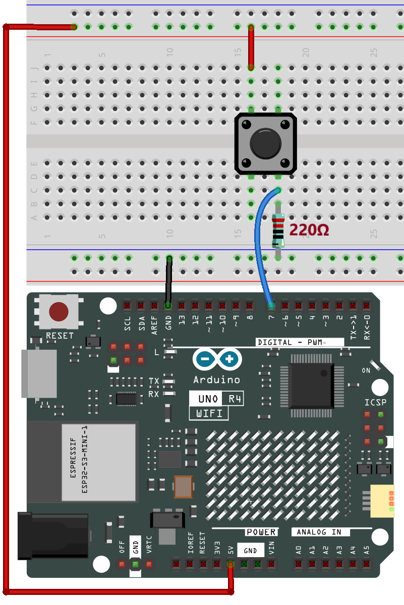
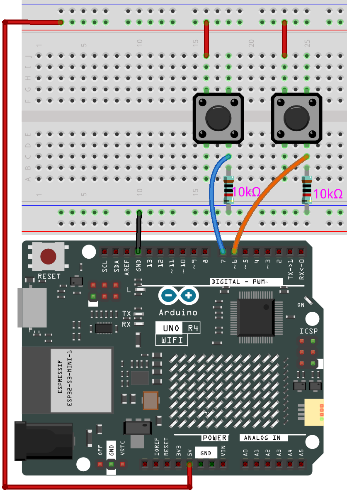

.. note::

    Hello, welcome to the SunFounder Raspberry Pi & Arduino & ESP32 Enthusiasts Community on Facebook! Dive deeper into Raspberry Pi, Arduino, and ESP32 with fellow enthusiasts.

    **Why Join?**

    - **Expert Support**: Solve post-sale issues and technical challenges with help from our community and team.
    - **Learn & Share**: Exchange tips and tutorials to enhance your skills.
    - **Exclusive Previews**: Get early access to new product announcements and sneak peeks.
    - **Special Discounts**: Enjoy exclusive discounts on our newest products.
    - **Festive Promotions and Giveaways**: Take part in giveaways and holiday promotions.

    👉 Ready to explore and create with us? Click [|link_sf_facebook|] and join today!

.. _new_hid:

USB HID
========================================

The Arduino Uno R4 WiFi is not just a powerful development board; it also comes with built-in support for Human Interface Devices (HID). This enables you to use the board to emulate devices like mice and keyboards, adding a new level of interactivity to your projects.

HID, or Human Interface Devices, are a category of computer devices designed for direct interaction with humans, typically for input purposes. This category includes devices like keyboards, mice, and game controllers. With the Arduino Uno R4 WiFi, you can emulate these devices, thereby unlocking a host of possibilities for DIY projects.

Mouse Control
-------------------

Controlling a mouse using the Arduino Uno R4 WiFi is straightforward. By using the ``Mouse.move(x,y)`` command, you can easily control mouse movement. When updating the cursor position, it is always relative to the cursor’s previous location.

Here's a simple example that demonstrates mouse cursor control using a button.

**Circuit Diagram**

**Upload the Code**

Open the ``05-hid_mouse.ino`` file located at ``elite-explorer-kit-main\r4_new_feature\05-hid_mouse``, or paste the following code into your Arduino IDE.

.. warning::
    When you use the ``Mouse.move()`` command, the Arduino takes over your computer's mouse! To insure you don't lose control of your computer while running a sketch with this function, make sure to set up a reliable control system before you call ``Mouse.move()``. This sketch includes a pushbutton to toggle the mouse, so that it only runs after the button is pressed.

.. warning:: 
    Due to the multi-processor architecture of the UNO R4 WiFi board, you may face **"No device found on..."** errors while uploading code that uses HID functionalities.
    
    To upload under such circumstances, follow these steps:
    
    1. Quickly press and release the "RESET" button on the board twice. The LED marked "L" should start pulsing.
    
    2. From the Arduino IDE menu, select the board’s port. The port may change following the reset, so ensure it’s correctly selected.

.. raw:: html

   <iframe src=https://create.arduino.cc/editor/sunfounder01/4b72e0f4-57cb-4627-b728-10a16f61d15c/preview?embed style="height:510px;width:100%;margin:10px 0" frameborder=0></iframe>

In addition to controlling mouse movement, you can also handle mouse clicks. For more details, refer to |link_r4_usb_mouse|.

.. _new_hid_keyboard:

Keyboard Control
-------------------

The Arduino Uno R4 WiFi also provides keyboard emulation capabilities. It allows you to send not only individual keypresses but also execute complex key combinations.

.. warning::
   When you use the ``Keyboard.print()`` command, the Arduino takes over your computer's keyboard! To insure you don't lose control of your computer while running a sketch with this function, make sure to set up a reliable control system before you call ``Keyboard.print()``. This sketch includes a pushbutton to toggle the keyboard, so that it only runs after the button is pressed.

**Example Code for Sending Shortcut Keys**
++++++++++++++++++++++++++++++++++++++++++++++++++++++++++++

In this instance, the Arduino Uno R4 WiFi is configured to emulate two frequently-used keyboard shortcuts: "Ctrl+C" for copy and "Ctrl+V" for paste. Two physical buttons connected to the Arduino serve as triggers. The button connected to pin 7 initiates the copy action, while the one connected to pin 8 triggers paste.

Upon pressing either button, the Arduino employs the ``Keyboard.press()`` and ``Keyboard.releaseAll()`` functions to mimic the respective keyboard shortcuts. This example illustrates how you can design a dedicated hardware interface for specific tasks, facilitating repetitive actions without keyboard involvement. This could be especially advantageous in workplaces requiring quick data manipulation or in accessibility setups that benefit from simplified controls.

**Circuit Diagram**

**Upload the Code**

Open the ``06-hid_keyboard.ino`` file located at ``elite-explorer-kit-main\r4_new_feature\06-hid_keyboard``, or paste the following code into your Arduino IDE.

.. raw:: html

   <iframe src=https://create.arduino.cc/editor/sunfounder01/2a5b61d3-d5d6-4c78-a3a0-73880fa1fb57/preview?embed style="height:510px;width:100%;margin:10px 0" frameborder=0></iframe>

Caveats and Tips
-------------------

1. **Cautionary Note on Mouse and Keyboard Libraries**: If either the Mouse or Keyboard library is running continuously, it could interfere with your board's programming. Functions like ``Mouse.move()`` and ``Keyboard.print()`` will assume control of your connected computer and should be invoked only when you're prepared to manage them. It's advised to use a control system, such as a physical switch or specific input controls, to toggle this functionality.

2. **If You Encounter Code Upload Issues**: Due to the multi-processor architecture of the UNO R4 WiFi board, you may face ``"No device found on..."`` errors while uploading code that uses HID functionalities.

   To upload under such circumstances, follow these steps:
   
   1. Quickly press and release the "RESET" button on the board twice. The LED marked "L" should start pulsing.
   
   2. From the Arduino IDE menu, select the board's port. The port may change following the reset, so ensure it's correctly selected.

**Reference**

- |link_r4_usb_hid|
- |link_r4_usb_mouse|
- |link_r4_usb_keyboard|