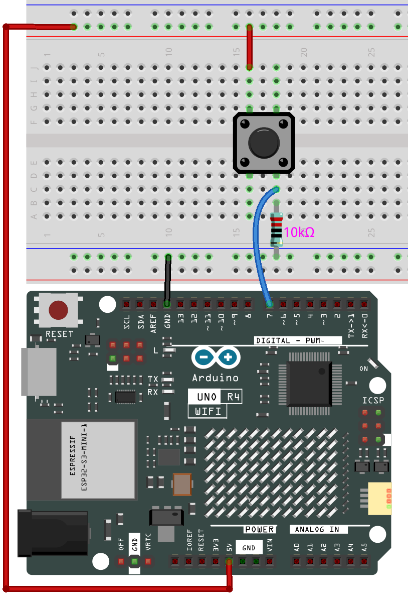

.. note::

    ¡Hola! Bienvenido a la Comunidad de Entusiastas de SunFounder para Raspberry Pi, Arduino y ESP32 en Facebook. Sumérgete en el mundo de Raspberry Pi, Arduino y ESP32 junto a otros entusiastas.

    **¿Por qué unirse?**

    - **Soporte experto**: Resuelve problemas postventa y desafíos técnicos con la ayuda de nuestra comunidad y equipo.
    - **Aprende y comparte**: Intercambia consejos y tutoriales para mejorar tus habilidades.
    - **Avances exclusivos**: Obtén acceso anticipado a anuncios de nuevos productos y adelantos exclusivos.
    - **Descuentos especiales**: Disfruta de descuentos exclusivos en nuestros productos más recientes.
    - **Promociones y sorteos festivos**: Participa en sorteos y promociones festivas.

    👉 ¿Listo para explorar y crear con nosotros? Haz clic en [|link_sf_facebook|] y únete hoy mismo.

.. _new_hid:

HID USB
==========================================

El Arduino Uno R4 WiFi no es solo una poderosa placa de desarrollo; también viene con soporte integrado para Dispositivos de Interfaz Humana (HID). Esto te permite usar la placa para emular dispositivos como ratones y teclados, añadiendo un nuevo nivel de interactividad a tus proyectos.

HID, o Dispositivos de Interfaz Humana, son una categoría de dispositivos informáticos diseñados para la interacción directa con los humanos, típicamente con fines de entrada. Esta categoría incluye dispositivos como teclados, ratones y controladores de juegos. Con el Arduino Uno R4 WiFi, puedes emular estos dispositivos, desbloqueando así un sinfín de posibilidades para proyectos DIY.

Control de Ratón
----------------------

Controlar un ratón usando el Arduino Uno R4 WiFi es sencillo. Usando el comando ``Mouse.move(x,y)``, puedes controlar fácilmente el movimiento del ratón. Al actualizar la posición del cursor, siempre es relativo a la ubicación anterior del cursor.

Aquí tienes un ejemplo sencillo que demuestra el control del cursor del ratón usando un botón.

**Diagrama del Circuito**

**Subir el Código**

Abre el archivo ``05-hid_mouse.ino`` ubicado en ``elite-explorer-kit-main\r4_new_feature\05-hid_mouse``, o pega el siguiente código en tu Arduino IDE.

.. warning::
    Cuando usas el comando ``Mouse.move()``, ¡el Arduino toma el control del ratón de tu computadora! Para asegurarte de no perder el control de tu computadora mientras ejecutas un sketch con esta función, asegúrate de configurar un sistema de control confiable antes de llamar a ``Mouse.move()``. Este sketch incluye un botón pulsador para activar el ratón, de modo que solo funcione después de presionar el botón.

.. warning:: 
    Debido a la arquitectura multiprocesador de la placa UNO R4 WiFi, es posible que enfrentes errores de **"No se encuentra el dispositivo en..."** al subir código que usa funcionalidades HID.
    
    Para subir el código en tales circunstancias, sigue estos pasos:
    
    1. Presiona y suelta rápidamente el botón "RESET" en la placa dos veces. El LED marcado como "L" debería empezar a parpadear.
    
    2. Desde el menú del Arduino IDE, selecciona el puerto de la placa. El puerto puede cambiar después del reinicio, así que asegúrate de seleccionarlo correctamente.

.. raw:: html

   <iframe src=https://create.arduino.cc/editor/sunfounder01/4b72e0f4-57cb-4627-b728-10a16f61d15c/preview?embed style="height:510px;width:100%;margin:10px 0" frameborder=0></iframe>

Además de controlar el movimiento del ratón, también puedes manejar los clics del ratón. Para más detalles, consulta |link_r4_usb_mouse|.

.. _new_hid_keyboard:

Control de Teclado
-------------------

El Arduino Uno R4 WiFi también proporciona capacidades de emulación de teclado. Te permite enviar no solo pulsaciones de teclas individuales, sino también ejecutar combinaciones de teclas complejas.

.. warning::
   Cuando usas el comando ``Keyboard.print()``, ¡el Arduino toma el control del teclado de tu computadora! Para asegurarte de no perder el control de tu computadora mientras ejecutas un sketch con esta función, asegúrate de configurar un sistema de control confiable antes de llamar a ``Keyboard.print()``. Este sketch incluye un botón pulsador para activar el teclado, de modo que solo funcione después de presionar el botón.

**Código de Ejemplo para Enviar Atajos de Teclado**
++++++++++++++++++++++++++++++++++++++++++++++++++++++++++++

En este caso, el Arduino Uno R4 WiFi está configurado para emular dos atajos de teclado frecuentemente usados: "Ctrl+C" para copiar y "Ctrl+V" para pegar. Dos botones físicos conectados al Arduino sirven como disparadores. El botón conectado al pin 7 inicia la acción de copiar, mientras que el conectado al pin 8 inicia la acción de pegar.

Al presionar cualquiera de los botones, el Arduino emplea las funciones ``Keyboard.press()`` y ``Keyboard.releaseAll()`` para imitar los respectivos atajos de teclado. Este ejemplo ilustra cómo puedes diseñar una interfaz de hardware dedicada para tareas específicas, facilitando acciones repetitivas sin la intervención del teclado. Esto puede ser especialmente ventajoso en entornos de trabajo que requieren manipulación rápida de datos o en configuraciones de accesibilidad que se benefician de controles simplificados.

**Diagrama del Circuito**

.. image:: img/05_hid_2_bb.png
  :width: 70%
  :align: center

**Subir el Código**

Abre el archivo ``05-hid_keyboard.ino`` ubicado en ``elite-explorer-kit-main\r4_new_feature\05-hid_keyboard``, o pega el siguiente código en tu Arduino IDE.

.. raw:: html

   <iframe src=https://create.arduino.cc/editor/sunfounder01/2a5b61d3-d5d6-4c78-a3a0-73880fa1fb57/preview?embed style="height:510px;width:100%;margin:10px 0" frameborder=0></iframe>

Advertencias y Consejos
---------------------------

1. **note de Precaución sobre las Bibliotecas de Ratón y Teclado**: Si cualquiera de las bibliotecas Mouse o Keyboard está ejecutándose continuamente, podría interferir con la programación de tu placa. Funciones como ``Mouse.move()`` y ``Keyboard.print()`` tomarán el control de tu computadora conectada y deben invocarse solo cuando estés preparado para gestionarlas. Se recomienda usar un sistema de control, como un interruptor físico o controles de entrada específicos, para activar esta funcionalidad.

2. **Si Encuentras Problemas al Subir el Código**: Debido a la arquitectura multiprocesador de la placa UNO R4 WiFi, es posible que enfrentes errores de ``"No se encuentra el dispositivo en..."`` al subir código que usa funcionalidades HID.

   Para subir el código en tales circunstancias, sigue estos pasos:
   
   1. Presiona y suelta rápidamente el botón "RESET" en la placa dos veces. El LED marcado como "L" debería empezar a parpadear.
   
   2. Desde el menú del Arduino IDE, selecciona el puerto de la placa. El puerto puede cambiar después del reinicio, así que asegúrate de seleccionarlo correctamente.

**Referencia**

- |link_r4_usb_hid|
- |link_r4_usb_mouse|
- |link_r4_usb_keyboard|