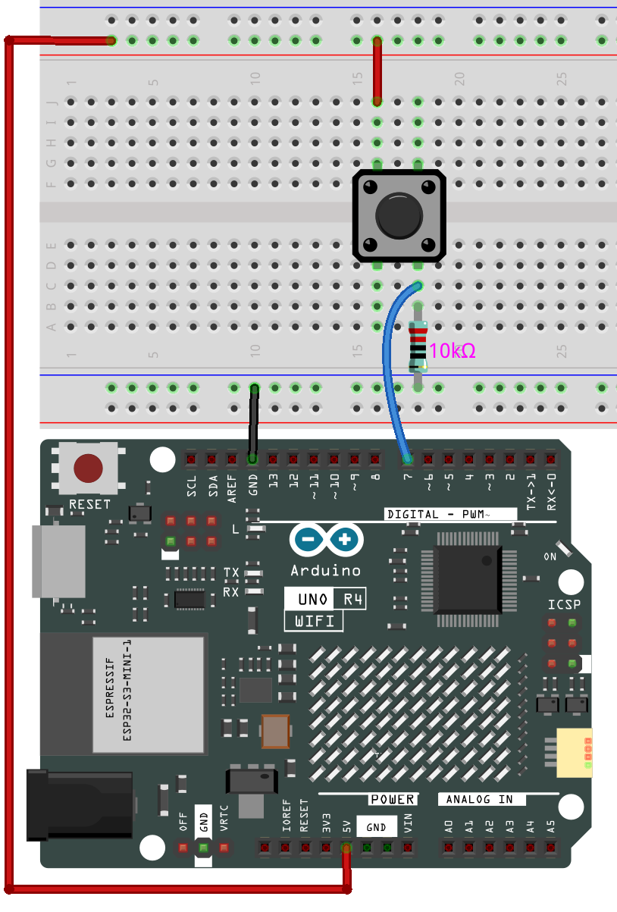
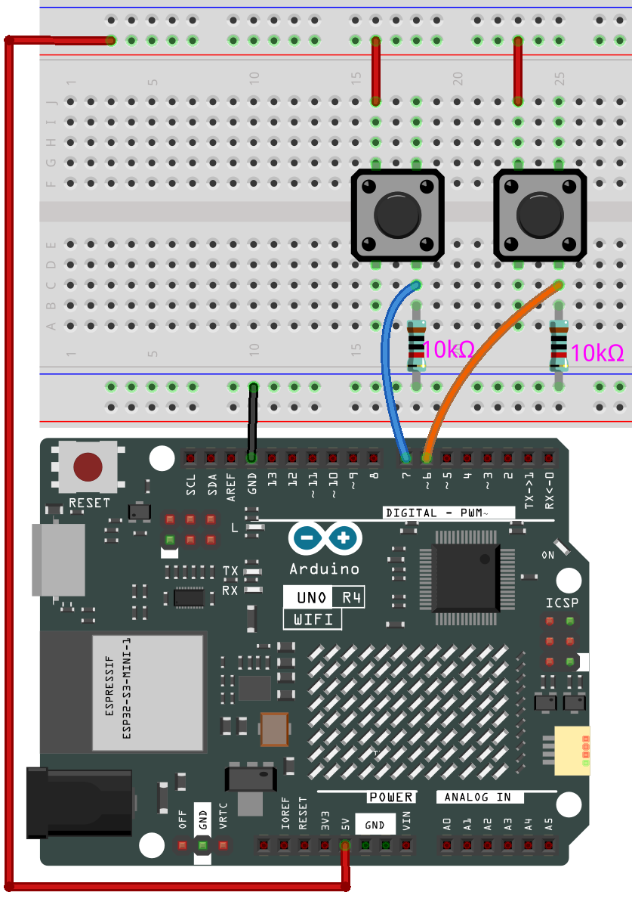

.. _new_hid:

USB HID
========================================

Arduino Uno R4 WiFi 不仅是一个功能强大的开发板，它还内置了对人机接口设备 (HID) 的支持。这使您可以使用该板模拟鼠标和键盘等设备，为您的项目增加新的交互性。

HID，即人机接口设备，是一类计算机设备，设计用于与人类直接交互，通常用于输入目的。此类设备包括键盘、鼠标和游戏控制器。借助 Arduino Uno R4 WiFi，您可以模拟这些设备，从而为 DIY 项目开启大量可能性。

鼠标控制
-------------------

使用 Arduino Uno R4 WiFi 控制鼠标非常简单。通过使用 ``Mouse.move(x,y)`` 命令，您可以轻松控制鼠标移动。更新光标位置时，它始终相对于光标的先前位置。

以下是一个简单的示例，演示了如何使用按钮控制鼠标光标。

**电路图**

**上传代码**

打开位于 ``elite-explorer-kit-main\r4_new_feature\05-hid_mouse`` 的 ``05-hid_mouse.ino`` 文件，或将以下代码粘贴到您的 Arduino IDE 中。

.. warning::
    当您使用 ``Mouse.move()`` 命令时，Arduino 会接管您计算机的鼠标！为了确保在运行使用此功能的 sketch 时不会失去对计算机的控制，请确保在调用 ``Mouse.move()`` 之前设置一个可靠的控制系统。此 sketch 包含一个按钮来切换鼠标，因此只有在按下按钮后才会运行。

.. warning::
    由于 UNO R4 WiFi 板的多处理器架构，在上传使用 HID 功能的代码时，您可能会遇到 **"No device found on..."** 错误。

    要在这种情况下上传，请按照以下步骤操作：

    1. 快速按下并松开板上的 "RESET" 按钮两次。标记为 "L" 的 LED 应开始闪烁。

    2. 从 Arduino IDE 菜单中，选择板的端口。复位后端口可能会改变，因此请确保正确选择。

.. literalinclude:: /_code/05_hid_mouse.ino
   :language: cpp
   :linenos:
   :caption: 05-hid_mouse.ino

除了控制鼠标移动，您还可以处理鼠标点击。有关更多详细信息，请参阅 |link_r4_usb_mouse| 。

.. _new_hid_keyboard:

键盘控制
-------------------

Arduino Uno R4 WiFi 还提供键盘模拟功能。它允许您不仅发送单个按键，还可以执行复杂的组合键。

.. warning::
    当您使用 ``Keyboard.print()`` 命令时，Arduino 会接管您计算机的键盘！为了确保在运行使用此功能的 sketch 时不会失去对计算机的控制，请确保在调用 ``Keyboard.print()`` 之前设置一个可靠的控制系统。此 sketch 包含一个按钮来切换键盘，因此只有在按下按钮后才会运行。

**发送快捷键的示例代码**
++++++++++++++++++++++++++++++++++++++++++++++++++++++++++++

在此实例中，Arduino Uno R4 WiFi 被配置为模拟两个常用的键盘快捷键："Ctrl+C" 用于复制，"Ctrl+V" 用于粘贴。连接到 Arduino 的两个物理按钮用作触发器。连接到引脚 7 的按钮启动复制操作，而连接到引脚 8 的按钮触发粘贴。

按下任一按钮时，Arduino 使用 ``Keyboard.press()`` 和 ``Keyboard.releaseAll()`` 函数模拟相应的键盘快捷键。此示例说明了如何为特定任务设计专用硬件接口，从而无需键盘即可方便地执行重复性操作。这在需要快速数据操作的工作场所或受益于简化控制的无障碍设置中可能特别有利。

**电路图**

**上传代码**

打开位于 ``elite-explorer-kit-main\r4_new_feature\05-hid_keyboard`` 的 ``05-hid_keyboard.ino`` 文件，或将以下代码粘贴到您的 Arduino IDE 中。

.. literalinclude:: /_code/05_hid_keyboard.ino
   :language: cpp
   :linenos:
   :caption: 05-hid_keyboard.ino

注意事项和技巧
-------------------

1. **关于鼠标和键盘库的注意事项** ：如果鼠标或键盘库连续运行，可能会干扰您的板编程。像 ``Mouse.move()`` 和 ``Keyboard.print()`` 这样的函数将接管您已连接的计算机的控制权，只应在您准备好管理它们时调用。建议使用控制系统，例如物理开关或特定的输入控制，来切换此功能。

2. **如果遇到代码上传问题** ：由于 UNO R4 WiFi 板的多处理器架构，在上传使用 HID 功能的代码时，您可能会遇到 ``"No device found on..."`` 错误。

   要在这种情况下上传，请按照以下步骤操作：

   1. 快速按下并松开板上的 "RESET" 按钮两次。标记为 "L" 的 LED 应开始闪烁。

   2. 从 Arduino IDE 菜单中，选择板的端口。复位后端口可能会改变，因此请确保正确选择。

**参考**

- |link_r4_usb_hid|
- |link_r4_usb_mouse|
- |link_r4_usb_keyboard|
