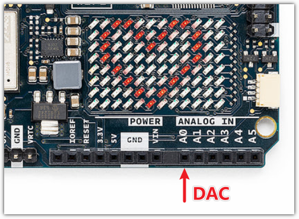

.. note::
    Ciao, benvenuto nella Community SunFounder Raspberry Pi & Arduino & ESP32 su Facebook! Approfondisci le tue conoscenze su Raspberry Pi, Arduino e ESP32 insieme ad altri appassionati.

    **Perché unirti?**

    - **Supporto esperto**: Risolvi problemi post-vendita e sfide tecniche con l'aiuto della nostra community e del nostro team.
    - **Impara e condividi**: Scambia suggerimenti e tutorial per migliorare le tue abilità.
    - **Anteprime esclusive**: Ottieni accesso anticipato agli annunci dei nuovi prodotti e anteprime esclusive.
    - **Sconti speciali**: Godi di sconti esclusivi sui nostri prodotti più recenti.
    - **Promozioni festive e giveaway**: Partecipa a giveaway e promozioni festive.

    👉 Pronto a esplorare e creare con noi? Clicca su [|link_sf_facebook|] e unisciti oggi!

.. _new_dac:

Convertitore Digitale-Analogico (DAC)
========================================

L'Arduino Uno R4 WiFi è dotato di una funzionalità DAC (Convertitore Digitale-Analogico) integrata. Un DAC è fondamentale per convertire i segnali digitali nei loro corrispettivi analogici, una funzionalità particolarmente vitale in applicazioni come l'elaborazione audio, la generazione di segnali analogici e altri scenari che richiedono un'uscita analogica precisa.

Il DAC sull'Uno R4 WiFi offre una risoluzione fino a 12 bit, fornendo capacità di uscita analogica reale che superano quelle dei pin PWM.

Suonare Musica con il DAC
+++++++++++++++++++++++++++++++

**Schema del Circuito**

.. image:: img/07_dac_bb.png
  :width: 100%
  :align: center

**Caricare il Codice**

Apri il file ``07-dac.ino`` situato in ``elite-explorer-kit-main\r4_new_feature\07-dac``, oppure incolla il seguente codice nel tuo Arduino IDE.

.. note:: 
    Assicurati di posizionare il file ``pitches.h`` nella stessa directory del codice per garantire il corretto funzionamento.

.. raw:: html

   <iframe src=https://create.arduino.cc/editor/sunfounder01/93e0379e-1d2d-4d9c-a603-42b3335e8e05/preview?embed style="height:510px;width:100%;margin:10px 0" frameborder=0></iframe>

Questo progetto sfrutta l'Arduino e il DAC (Convertitore Digitale-Analogico) per suonare il famoso tema di Super Mario Bros. Utilizza una libreria chiamata ``analogWave`` per la generazione di onde sinusoidali e un'altra libreria, ``pitches.h``, per definire le frequenze delle note.

- ``melody[]``: Questo array contiene le note da suonare insieme alle loro durate. Le note sono rappresentate da altezze predefinite (ad esempio, ``NOTE_E5``) e le durate sono rappresentate in termini di battiti (ad esempio, 4 indica una semiminima). Puoi provare a comporre la tua melodia modificando le note e le durate nell'array melody[]. Se sei interessato, esiste un repository su GitHub (|link_arduino_songs|) che fornisce codice Arduino per suonare diverse canzoni. Sebbene il loro approccio possa essere diverso da questo progetto, puoi fare riferimento alle loro note e durate. (Sostituisci semplicemente il melody[] nella traccia corrispondente con il codice in questo progetto.)

- ``tempo`` : Il tempo per questo progetto è impostato a 200 BPM (Battiti Per Minuto), utilizzato per calcolare la durata di ogni nota. Modificando questo valore, cambierai la velocità dell'esecuzione della canzone.

- **Generatore di onde sinusoidali**: La funzione ``sine`` della libreria ``analogWave`` inizializza un generatore di onde sinusoidali a 10 Hz, utilizzato per emettere le note tramite il DAC.

- **Durata della nota**: In base al tempo impostato e al conteggio dei battiti per ogni nota, viene calcolata la durata di ogni nota.

- **Riproduzione e pausa**: Ogni nota viene suonata per l'85% della sua durata calcolata, seguita da una pausa del 15% per distinguere tra le note.

- **Ciclo**: Al termine della melodia, il codice si resetta automaticamente e ricomincia a suonare.

Questo è un esempio che dimostra come utilizzare Arduino e hardware esterno (DAC) per generare musica. Mostra anche come utilizzare array e cicli per semplificare la logica della riproduzione musicale.

**Riferimenti**

- |link_r4_dac|
